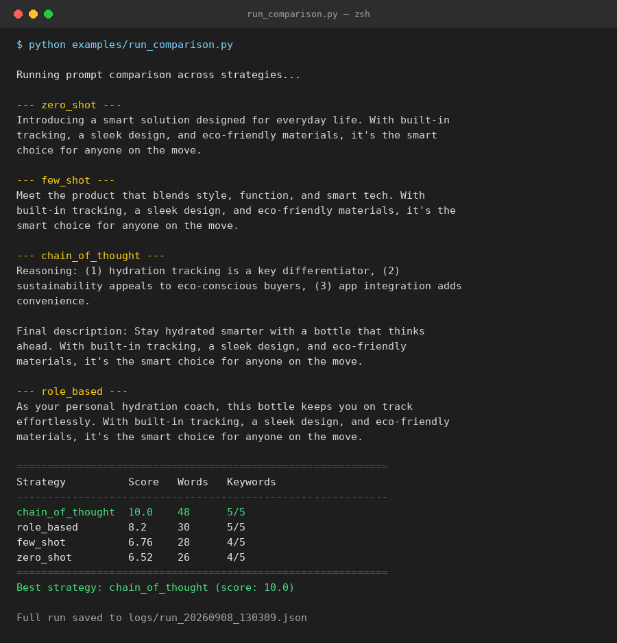

# Prompt Engineering Toolkit

A lightweight Python toolkit for **designing, testing, comparing, and scoring prompts** across different
prompting strategies (zero-shot, few-shot, chain-of-thought, role-based). Built to bring structure and
repeatability to prompt engineering work instead of ad-hoc trial and error.

## Why this project

Good prompt engineering isn't just "typing into ChatGPT until it works." It's:
- Designing prompt **templates** that are reusable and parameterized
- Testing multiple **strategies** on the same task and comparing outputs
- **Scoring** outputs against criteria (length, keyword coverage, structure, relevance)
- Logging **iterations** so you can see what changed and why it helped

This toolkit implements that workflow end-to-end.

## Features

- 📁 **Template library** — reusable prompt templates stored as JSON (zero-shot, few-shot, chain-of-thought, role-based)
- 🔧 **Prompt Builder** — fills templates with variables to generate final prompts
- 🤖 **API Client** — pluggable client supporting OpenAI, Anthropic, or a built-in **Mock mode** (no API key required to try it out)
- 📊 **Evaluator** — scores responses on length, keyword coverage, and structure, and ranks strategies side-by-side
- 📝 **Iteration Log** — every run is saved to `logs/` so you can track prompt versions over time

## Project Structure

```
prompt-engineering-toolkit/
├── README.md
├── requirements.txt
├── templates/
│   └── strategies.json          # prompt templates (zero-shot, few-shot, CoT, role-based)
├── toolkit/
│   ├── __init__.py
│   ├── prompt_builder.py        # fills templates with variables
│   ├── api_client.py            # calls OpenAI / Anthropic / Mock
│   └── evaluator.py             # scores + compares outputs
├── examples/
│   ├── run_comparison.py        # end-to-end demo: build -> call -> score -> compare
│   └── sample_output.md         # example results from a comparison run
└── logs/                        # auto-created; stores JSON logs of each run
```

## Quick Start
Just type this python app.py then it run 
```bash
git clone https://github.com/<your-username>/prompt-engineering-toolkit.git
cd prompt-engineering-toolkit
pip install -r requirements.txt

# Runs instantly in Mock mode — no API key needed
python examples/run_comparison.py
```

To use a real model, set an environment variable before running:

```bash
export LLM_PROVIDER=openai        # or "anthropic"
export OPENAI_API_KEY=sk-...      # or ANTHROPIC_API_KEY=...
python examples/run_comparison.py
```

## Example Output

Running the comparison script tests the same task ("write a product description for a smart water bottle")
across four prompting strategies and scores each one:



See [`examples/sample_output.md`](examples/sample_output.md) for the full text of every response.

## Adding Your Own Templates

Edit `templates/strategies.json` — each entry defines a strategy name, a prompt template with `{variables}`,
and a short description of when to use it. The builder and evaluator automatically pick up new entries.

## Roadmap

- [ ] Add support for automatic A/B testing across multiple LLM providers
- [ ] Add a Streamlit UI for non-technical prompt review
- [ ] Add semantic-similarity scoring (embeddings) alongside keyword scoring

## Author

Shivam Sinha — BCA graduate, exploring AI/ML fundamentals and prompt engineering.
[LinkedIn](https://linkedin.com/in/shivam-sinha-124455249)

## License

MIT
